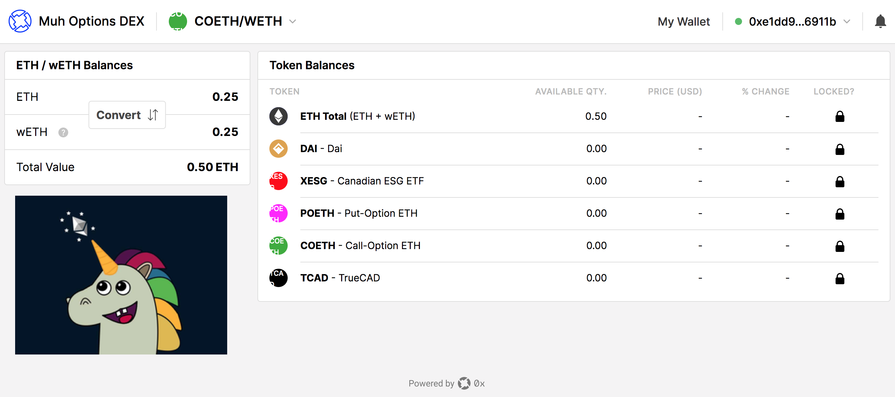

# OptionsDEX
ETHWaterloo Hackathon 2019 (accessible thru Venu's WiFi at http://172.31.212.21:3001/). 

Note on tickers: poETH = put-option-ETH for example.

A peer-to-peer call and put options on Ethereum powered by UMA and 0x. Generally the user interacts with an issuance and/or and exchange interface. In Issuance page, the user can create a "put" or "call" option on any finance asset that can have a price feed. For example, Alice can create an option that says "I would like to _have the option_ to buy ETH at $200 6 months from now". That option is a tokenized derivative (ERC20) that automatically gets listed on the DEX: the exchange interface (DEX = decentralized exchange). A counterparty can see that "option" and satify it, for a fee of course. So the counterparty "buys" that option, effectively earning a fee while pledging to deliver the ETH to Alice 6 months from now. 

A "put" option is the reverse: Alice buys the option to _sell_ an asset at some point in the future. 

## DEX: 

### _Backend_:
`git clone https://github.com/0xProject/0x-launch-kit-backend`

`cd 0x-launch-kit-backend`

`vim .env` # edit this: `RPC_URL="https://kovan.infura.io/v3/[`PUT YOUR INFURA KEY HERE`]`

`yarn start:js`

### _Frontend_:
(in another terminal tab):

`git clone https://github.com/aliatiia/OptionsDEX`

`cd OptionsDEX`

`REACT_APP_RELAYER_URL="http://localhost:3000/v2" yarn start`

(note: it may take up to ~2 minutes)

Visit the DEX at `http://localhost:3001/` in your borwser.

## Issuance:
TODO: a frontend to mint new put/call options (UMA's modified factory contract) and auto-listing them on OptionsDEX

